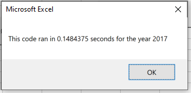

# stock-analysis
## Overview of Project
Steve is analyzing green energy stocks and wants our help. We've already created VBA script to give him an analysis at the click of a button. However, he wants us to change our code so we can include data over the last few years. Our current code will only work with dozens of stocks, but not thousands. We need to change that by refactoring our code.
## Results
I changed three variables to arrays: ticker volumes, ticker starting prices, and ticker ending prices. I also created a tickerIndex variable.

    '1a) Create a ticker Index
    tickerIndex = 0

    '1b) Create three output arrays
    Dim tickerVolumes(12) As Long
    Dim tickerStartingPrices(12) As Single
    Dim tickerEndingPrices(12) As Single
    
    
    ''2a) Create a for loop to initialize the tickerVolumes to zero.
    For i = 0 To 11
    
        tickerVolumes(i) = 0
        
    Next i
    
        ''2b) Loop over all the rows in the spreadsheet.
        For i = 2 To RowCount
    
            '3a) Increase volume for current ticker
            tickerVolumes(tickerIndex) = tickerVolumes(tickerIndex) + Cells(i, 8).Value
        
        
            '3b) Check if the current row is the first row with the selected tickerIndex.
            If Cells(i - 1, 1).Value <> tickers(tickerIndex) And Cells(i, 1).Value = tickers(tickerIndex) Then
                    
                tickerStartingPrices(tickerIndex) = Cells(i, 6).Value
            
            End If
        
            '3c) check if the current row is the last row with the selected ticker
            'If the next row’s ticker doesn’t match, increase the tickerIndex.
            If Cells(i + 1, 1).Value <> tickers(tickerIndex) And Cells(i, 1).Value = tickers(tickerIndex) Then
                    
                tickerEndingPrices(tickerIndex) = Cells(i, 6).Value
                
            End If
            
                '3d Increase the tickerIndex.
                If Cells(i, 1).Value = tickers(tickerIndex) And Cells(i + 1, 1).Value <> tickers(tickerIndex) Then
                    
                    tickerIndex = tickerIndex + 1
                
                End If
        
        Next i
            
    
    '4) Loop through your arrays to output the Ticker, Total Daily Volume, and Return.
    For i = 0 To 11
        
        Worksheets("All Stocks Analysis").Activate
        Cells(4 + i, 1).Value = tickers(i)
        Cells(4 + i, 2).Value = tickerVolumes(i)
        Cells(4 + i, 3).Value = (tickerEndingPrices(i) / tickerStartingPrices(i)) - 1
        
    Next i

The original code's runtime was 0.668 seconds for 2017. The image below shows the runtime of the refactored code for 2017. This shows the refactored code runs faster than the original code.\

The original code's runtime was 0.629 seconds for 2018. The image below shows the runtime of hte refactored code for 2018. This shows the refactored code runs faster than the original code.\

## Summary
### Advantages and Disadvantages of Refactoring Code
There are advantages to refactoring code. One of the biggest advantages is effeciency. Effecient code is more organized, takes fewer steps, and easier to fix bugs. If code appears to be messy or takes way more steps than it should, then refactoring should be done. However, there are some disadvantages to refactoring. You don't want to refactor code if you don't have enough time. Also, if refactoring code costs more than just rewriting the code from the beginning.
### Advantages and Disadvantages of the Original and Refactored VBA Script
